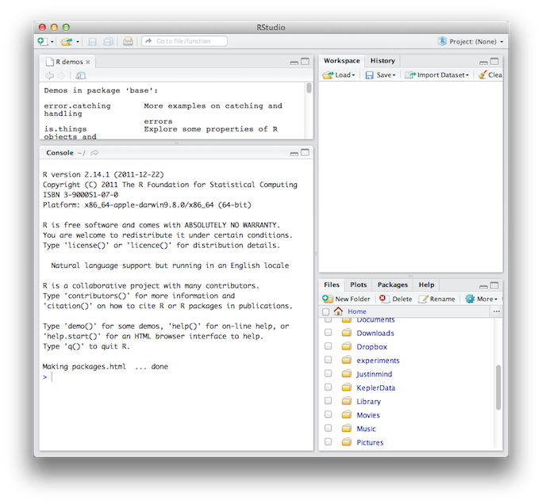

## 1. Overview

This lab will introduce you to R, RStudio, and R Markdown, a suite of tools we will be using for labs in this course. 

R is a free and open-source programming language and set of packages for statistics, graphing, and modeling, originally developed by statisticians. In recent years, R has become extremely popular among ecologists, and you will almost certainly encounter it as part of real-world research projects. Although you won't be writing your own R programs from scratch in this course, you will learn some R basics.

Rather than use the R console directly, we will use RStudio, an "integrated development environment" (IDE) for R. An IDE is a software application that lets you write, execute code, debug, and interact graphically with programs. RStudio integrates a text editor, the R console (where you execute R commands), package management, plotting, and more. In addition to reducing window clutter, RStudio also makes it really easy to compile R Markdown files, the file type you will be submitting for your weekly lab assignments.

R Markdown is a plain-text formatting language that can be used to combine text, code, plots, tables, and images into a single document in a variety of formats (PDF, .docx, HTML, and many others). R Markdown's greatest strengths are its transparency and reproducibility. Increasingly, R Markdown scripts are included as supplementary files to manuscript submissions.

This week, like most weeks, you will submit an R Markdown file via Canvas that contains a combination of R code and written responses. 

## 2. Installing R and RStudio

R should be pre-installed on all campus computers. If you're using your own computer and have not yet installed it, you can download the distribution here for free here:

http://cran.us.r-project.org/

Run the installer as directed. We won't interact with the installed R application directly, but R software components will be used by RStudio.

RStudio should also be pre-installed on our campus computers. For your personal machine, RStudio is available for download here:

http://rstudio.org

## 3. Getting Around RStudio

When you start RStudio, you will see four panels on the screen:

* **Upper-left:** an area for viewing and editing text files, by default showing a list of built-in R demos
* **Lower-left:** the Console, or command line, where you send commands to R
* **Upper-right:** Two tabs: 
    * *Workspace*: for loading/saving/examining data 
    * *History*: a list of commands you've typed
* **Lower-right:** Four tabs:
    * *Files*: a list of files in the "working directory" (more on this later)
    * *Plots*: where the plots / figures you "print" will appear
    * *Packages*: an area for managing installed R packages
    * *Help*: access to official documentation for R

   

### A Simple Calculation

Let's start by typing some simple calculations into the console. The `>` symbol indicates that R is waiting for you... to type something. Click on the console, type `2 + 2`, hit Return, and R should produce the right answer:

```
> 2 + 2
[1] 4
>
```

Now, press the Up arrow on the keyboard. You'll notice that the `2 + 2` you typed is recorded. Use the Up and Down arrows to access your previous commands, which can help you avoid repetitively typing the same commands when you're working on a problem. You can edit these historical commands, e.g. you can change the `2` to a `3` and press Return again:

```
> 2 + 3
[1] 5
>
```

If you were wondering, the `[1]` at the beginning of the result means that the following number is at position 1 of a vector. In this case, the vector only has one element.

Now let's walk through the process of opening and executing lab scripts.

### Setting the Working Directory

When you ask R to execute a program or load data from a file, it needs to know where to find the file. Unless you specify the complete path to the file on your machine, it assumes files are present in the "working directory."

The first thing you should do when starting a new project is to create a directory (folder) on your computer where you will store all the files related to the project, and then tell R to set that location as the working directory.

The R command `setwd('/path/to/directory')` is used to set the working directory, and `getwd()` will return the current working directory. On Windows, the path can be copied from the Windows explorer address bar, but each backslash `\` must either be doubled `\\` or replaced with a forward slash `/`. On a Mac, you can find the path by selecting a folder and choosing File > Get Info (the path is under "Where:").

**Task 1:**  Create a folder named `lab01` on your computer and set it as the working directory in R. Ensure you have succeeded by executing the `getwd()` command (in Rstudio, the current working directory is visible at the top of the console pane, next to the word Console).

*Note:* If you're using a lab computer, you can create this directory and save the files onto the local machine to work on during class. If you want to save the files you'll need to copy them to your personal computer, a USB drive, your UM network file space, or some other cloud platform before leaving lab.

*Another Note:* You can also use the RStudio file browser to set the working directory, but if you work with R a lot, you'll get out of this habit because it is slower.

### Packages

One of the primary reasons that ecologists use R is the availability of hundreds (7111, currently) of free, user-contributed pieces of software, called packages. Packages are generally created by people who wanted to solve a particular problem for their own research and then realized that other people might find their code useful. Take a moment to browse the packages available on the main R site:

http://cran.r-project.org/web/packages/

To install a package, navigate to the R console and execute the command `install.packages('packagename')`

Note the quotation marks around the package name. You only need to install a package once. However, before you can use a package in an R session, you must load it with the `library()` command.

`library(packagename)`

Note the *lack of* quotation marks when loading a package.

**Task 2:** Install and load the (very useful and extremely important!!) R package `blighty`, then call `blighty()`, the only function in the package:

`blighty()`

Now we're having fun! This time, call the function with an added specification:

`blighty(grid = TRUE)`

Notice how the graphical output shows up in the **Plots** pane.

RStudio also simplifies package management. In the **Packages** pane (top line of lower right portion of the screen) you can see a list of all installed packages. You can load/unload packages by checking the checkboxes, and you can install new packages using a graphical interface (although you'll still need to search CRAN for the package name). If you wish, you can also detach packages using the command line using the `detach()` command.

`detach("package:blighty", unload = TRUE)`

Unload the `blighty` package using your preferred method. 

### Functions and Variables

In EEB 485, the labs will involve the use of R functions (created by GSIs past and present) to investigate ecological concepts using models. A *function* in R can be thought of as a vending machine with inputs (coins of various denomination, plus the buttons you press for a particular item) and outputs (Mars bars, Coke, and the like). The inputs are termed "arguments" and the output is called the "result" or the "return value."

```
                 --------------
Argument 1 ----> |            |
Argument 2 ----> |  FUNCTION  | ----> Result/Return Value
Argument 3 ----> |            |
                 --------------
```

When you ask a function to do something, you're *calling* the function. You've already called functions: everything with a name followed by parentheses: `()`, possibly with things between the parentheses, is a function call: `setwd('/path/to/wd')`, `blighty()`, etc. The example `blighty(grid = TRUE)` includes what's called a *named argument*, `grid = TRUE`, which indicates that an argument named `grid` should take the value `TRUE`. Many functions allow arguments without names, which must appear in a standard order, but names tend to make code more legible and reduce the chance for mistakes.

When you execute a function call at the R command line, R displays the result on the next line. For example, try the following:

```
> round(5.5)
[1] 6
> 
```

R calls the function `round` with the argument `5.5`, which returns the result `6`. However, if you want to store the result, you need to assign it to a *variable* using an arrow operator: `->` or `<-`. It is possible to substitute `=` for `->`, but the R community generally disapproves of this, mostly for conceptual reasons (you won't get penalized for using equal signs).

```
> x <- round(5.5)
> round(6.5) -> y
```

R doesn't show you anything in the console, but RStudio shows the variable in the **Workspace** pane. (You'll also see the data that was loaded in with the `blighty` library.) You can print out the value of the variable by simply typing it at the prompt:

```
> x
[1] 6
> y
[1] 7
```

*Important Technical Note:* Whenever you assign something to a variable, R *evaluates* the expression and stores a *unique copy* of the data. Two variables never point to the same data: they always have their own copy. This means that variables are not automatically recalculated the way Excel formula cells are. If you change a value used in a calculation, you'll need to re-run the calculation to get a new result.

### Running code from a source file

Most of the functions that you will be using in this course will be defined in files containing R code ("source code"). By convention, R source files end with the `.R` extension.

*Unimportant Terminology Note:* It's called "source code" because it's the original stuff that a human types into a text editor. This differentiates it from various kinds of intermediate code that may exist between your fingers and the silicon-based transistors in the microprocessor. "Machine code" is the actual sequence of 1s and 0s that ends up being fed into the microprocessor.

Before you can use a function defined in an R source file, you have to run the source code in that file. You do this with a function call:

`source('source_filename.R')`

As always, the file is sourced from the working directory unless you specify otherwise.

To illustrate this process, let's run some source code that defines a function to calculate the Euclidean distance between two points, $f(x_1, y_1, x_2, y_2) = \sqrt{(x_1 - x_2)^2 + (y_1 - y_2)^2}$.

**Task 3:** Download `lab01_code.R` from the Computer Labs directory on Canvas into your `lab01` directory, and open it in RStudio for viewing. Execute the source file, thereby defining the function `distance`. Call the function, passing in the coordinates for the points $(x_1, y_1) = (1, 2)$, $(x_2, y_2) = (3, 4)$, and storing the result in the variable "distanceResult".

```
distanceResult <- distance(x1 = 1, y1 = 2, x2 = 3, y2 = 4)
```

Display the value of `distanceResult`. Does it makes sense?

## 4. Writing Documents with R Markdown

R Markdown is a plain-text language for writing documents that include R code. Rather than executing commands in one program and copying-and-pasting the results into Word, you can integrate human-language text, R commands, and the resulting plots in a single document. R Markdown is based on [Markdown](http://daringfireball.net/projects/markdown/), which was originally intended for efficient writing of blog posts.

R Markdown is a realization of a philosophy known as [literate programming](http://wikipedia.org/wiki/Literate_programming), which was formulated and promoted by the computer scientist Donald Knuth in the 1970s and has been largely ignored until recently. The idea is that computer code and human-language descriptions and interpretations of that code should be integrated into a single entity, thus creating a positive feedback between a piece of code and the thoughts of its human creator. This approach is highly desirable in scientific research, where reproducibility is a virtue. 

This is what an uncompiled R Markdown document looks like:

    ---
    title: "This is a title in an optional header section"
    author: "I am an author"
    date: "September 8, 2016"
    ---
    
    # This is another title, outside of the optional header section.
    
    This is also a title.
    =====================
    
    This is a normal paragraph. You can write most text pretty much the same
    way you'd write an email.
    
    ## This is a subtitle.
    ### This is a subsubtitle.
    ###### This is a subsubsubsubsubtitle.
    
    You can use bullet points:
    * This is a bullet point.
    ** so is this.

    You can even include equations. According to Einstein, the relationship
    between the energy $E$, momentum $p$, and mass $m$ of any
    physical system can be written
    
    \[ E^2 - p^2 c^2 = m^2 c^4 \]
    
    where $c$ is the speed of light.
    
    *This is italicized*, and so is _this_.  
    **This is bold**, and so is __this__.  
    Use ***italics and bold together*** if you ___have to___.  

    This is a code block that just looks like code, but won't be executed:
    
    ```
    x = 1 + 2
    y = 1 - 2
    z = x + y
    ```
    
    Here's a code block that will get executed using R.  
    The only difference is that extra little "{r}".
    (Ignore the space between the ``` if it appears for you.)  
    Notice how the result gets printed out afterwards.  
    
    ` ``{r}
    x = 2
    y = 3
    z = x * y
    z
    ```
    
    And here's one that generates a plot.
    You can ignore the details for now, but you should be amazed.
    
    ` ``{r}
    x = seq(0,20,by=0.1)
    y = sqrt(x)
    plot(x,y,'l')
    ```

Not so exciting in that form. But with one click, RStudio (or R, with some tweaks) can compile the RMarkdown script into a nicely formatted PDF, HTML, or .docx file that can be easily emailed, posted online, or uploaded to Canvas.

R Markdown depends on the `knitr` package.

**Task 4:** Install the `knitr` package.

**Task 5:** Create a R Markdown document in RStudio: File > New > R Markdown. Save the file as `lab01_yourlastname.Rmd` in your `lab01` directory. Look through the example file to see how it works, and then click the **Knit HTML** button.

If you look inside your `lab01` directory, you should see new file `lab01_yourlastname.html`.

*Magic Fact:* The HTML files generated by R Markdown are completely self-contained, including images. *Technical Magic Note for Techie Types*: If you're familiar with HTML this self-containedness may shock you. Look at the HTML file in a text editor if you're curious what's going on.

**Knit PDF** to produce a PDF file with the same content.

Now we'll see how you can execute code in the Console while editing an R Markdown document.

**Task 6:** Insert text in the .Rmd file with the example text above from this lab document. Click on a line of R code in the document and choose Code > Run Line(s) to do a test run of the line in the R console. (The quick way to do this is Command-Return on the Mac, Control-Return on Windows.) Click Chunks > Run Current Chunk to run an entire "chunk" of R code. Save your changes, and **Knit HTML** again.

Finally, let's put everything we've done into a single R Markdown document.

**Task 7:** Delete everything in the R Markdown file except the header with the title, your name, and the date. Complete the three following tasks, using a combination of R code and explanatory text:

1. Store `round(5.5)` in a variable and display the result.
2. Load the `blighty` library and print two versions of the british isles map (make sure they both appear in the compiled HTML).
3. Load the `lab01_code.R` source file. Using the `distance()` function, calculate the distance between two points. Store the answer in a variable and then show the result.

Do these one at a time to make sure everything is working, both when you run the code in the console and when you "knit" everything into HTML.

**Task 8:** Submit your R Markdown file `lab01_writeup_[your last name].Rmd` as well as the generated file `lab01_writeup_[your last name].html` to Canvas under Assignments.

### 5. Additional Reading

R:

* [R website](http://www.r-project.org)
* [CRAN package index](http://cran.r-project.org)

RStudio:

* [RStudio documentation](http://rstudio.org/docs/)

R Markdown:

* Click the **MD** button when editing an R Markdown file to show a quick-reference guide on Markdown syntax.
* [Using R Markdown with RStudio](http://www.rstudio.org/docs/authoring/using_markdown)
* [RPubs](http://rpubs.com) (R Markdown publication service)


