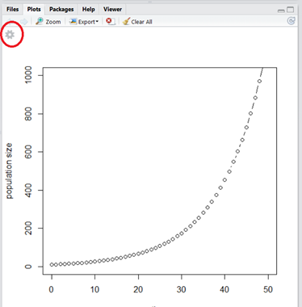
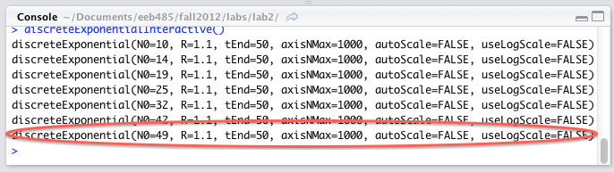

## I. Overview

In this lab we will be learning about exponential and logistic growth models. These are two of the simplest models that are studied in population ecology, but they illustrate core concepts that will be relevant throughout the course. 

As you work through the lab, answer the exercises in an R Markdown file. Submit your R Markdown (.Rmd) and generated HTML (.html) files to Canvas. Your answers should be brief and to the point, but should show that you understand the main concepts.

### Equations in R Markdown

It's easy to include attractively rendered equations in your R Markdown file. If you want an equation in the middle of a paragraph, for example, $a = (b + c)^d$, enclose it in dollar signs:

	...in the middle of a paragraph, for example, $a = (b + c)^d$, you enclose it in dollar signs.

To separate equations from the text, put the equation between a backslash-open bracket `\[` and a backslash-closing bracket `\]` as in:

  \[ a = (b + c)^d \]

Equations are in a format called LaTeX. The easiest way to put them together is to use the HostMath equation editor ([hostmath.com](http://www.hostmath.com/)), and then copy and paste into your R Markdown file. If you want to write equations by hand, you can consult this [printable cheat sheet](http://cs.brown.edu/system/software/latex/doc/symbols.pdf).

### Installing the `deSolve` and `manipulate` packages

Before you can run the code for the models in this lab, you'll need to install the `deSolve` and `manipulate` packages. There are several ways to install packages in R Studio, but the simplest is to do it from the command line:

```
install.packages('deSolve')
install.packages('manipulate')

```

### Installing and setting up the code for this lab

Create a folder to work in and save your R Markdown file in that directory. Download the R source code `lab02_code.R` from Canvas and place it in the same directory. The file, `lab02_code.R`, contains the functions and models you'll be using for this lab. Once it is in the same directory as your R Markdown document (i.e., once it is in the default working directory), load it using the `source()` command:

```
source('lab02_code.R')

```
Always remember to source the lab code in a code chunk at the top of your `.Rmd` file.

## II. Exponential growth in discrete time

The basic equation describing the exponential growth of a population in discrete time reads:

$$N_{t+1} = \lambda N_t$$

where $N_t$ is the number of individuals at time $t$. $\lambda$ represents the finite rate of increase (or geometric rate of growth), and is equal to $1 + B - D$, where $B$ and $D$ are the number of births and deaths per individual within one time step, respectively. Note that $\lambda$ is sometimes depicted as `R` in the ecological literature.

This is a recurrence relation, also called a difference equation, meaning that the value of the equation at any one time is a function of the values at preceding times (in this case it is a function of just the previous time). Recurrence relations are used to model populations in discrete time. Unfortunately, recurrence relations (and differential equations, which we will examine next) are not closed-form equations: if we wanted to know the population size at time 100, we could not just plug the initial population size $N_0$ and $t = 100$ into the equation above and get the answer. We have to start with the initial population size and repeatedly apply the above equation until we obtain the result we are looking for (which is why computers are rather handy in generating these solutions).

Side note: This is a relatively simple recurrence relation that *can* actually be converted into a closed-form equation mathematically, so we really would not have to use a computer. However, more complicated recurrence relations are simply not expressible in closed form and the only way to understand their behavior is to simulate them using a computer. We will see such an equation later in the lab.

### Exploring the model

To explore the discrete-time exponential growth model, enter the following line into the R console:

```
discreteExponentialInteractive()
```

A plot of an exponential-growth simulation will appear. You can adjust the size of the window by dragging the area between the window panes.

In addition to the plot, note the image of a gear in the upper-left-hand corner:



This will open up the Manipulate panel, where you can adjust parameter values. If the Manipulate panel isn't already showing, click the gear to bring it up. *Make sure* to expand the size of the plot until you see the entire manipulate panel.

Try changing the value of $\lambda$. Note that when you change a parameter value, a line of code is printed to the console. It is possible to paste that exact line of code into the console to reproduce the same plot (i.e., you don't have to use Manipulate):



If you want to save output from these interactive plots to a CSV file, say, to analyze it in another tool (e.g., Excel), you can copy the generated line of code, add a `filename` parameter, and type it at the R console. For example, 

```
> discreteExponential(N0=49, lambda=1.1, tEnd=50, axisNMax=1000, autoScale=FALSE, useLogScale=FALSE, filename='test-output.csv')
```

If you want to include a plot in an R Markdown file, you can copy/paste its corresponding line of code into a 'chunk' of R Markdown code. If you want to, you can suppress double-printing of the code and adjust the size of your plots (in inches) using "chunk options" in the chunk header (Note, you'll have to remove the space between the tick marks in the header if you plan on copy/pasting this exact example):

	` ``{r results='hide', fig.width=9, fig.height=6}
	discreteExponential(N0=49, R=1.1, tEnd=50, axisNMax=1000,
		autoScale=FALSE, useLogScale=FALSE)
	` ``

### Exercise 1

Experiment with different parameter values. The default parameter values are for an exponentially growing population with $lambda = 1.1$ that starts with 10 individuals and grows for 50 time steps. 

* What $\lambda$ value would result in a constant, non-zero population? 
* What happens if $\lambda$ is less than one? 
* How does the initial population size affect the model? 

As always, in your writeup, include plots illustrating these scenarios.

## III. Exponential growth in continuous time

The continuous-time version of the exponential growth model takes this form:

$$
\frac{dN}{dt} = r N
\label{eq:sample}
$$

where $N$ is the population's density at time $t$ (and time does not need to take integer values anymore), and $r$ is called the exponential rate of growth: it can be written as $b-d$, where $b$ is the per-capita birth rate (and is not equal to the $B$ used above!), and $d$ is the per-capita death rate (not the same as $D$).

The above equation is a differential equation, meaning that at any one time the amount a population is changing is a function of the current population size. As in the case of recurrence relations, this means that even if we know the starting population size we cannot just plug that into this equation and find out the population size at time $t$. So this is also not a closed-form equation. Also, just like recurrence relations, some differential equations can be mathematically transformed into closed form and some cannot. Whether a closed-form solution is possible or not, we can simulate them.

You can simulate this model by typing

```
continuousExponentialInteractive()
```

at the R console.

### Exercise 2

Look at the output of the default model ($r = 0.1$, $N_0 = 10$, final $t = 50$.  Now, try some different parameter values to see how the model behaves, e.g., try $r = 0.2$, or run the model for 200 time units instead of 50. 

* Describe the qualitative difference between the behaviors of exponential growth in continuous versus discrete time.

### Exercise 3

* Given the closed-form equations for discrete growth ($N_t = \lambda^tN_0$) and continuous growth ($N_t = N_0e^{rt}$), what is the mathematical relationship between $r$ and $\lambda$? To answer this question, first determine the $r$ and $\lambda$ values for which the population is not growing (then you have at least one pair of corresponding values). Then try to determine the general relationship. Do not hesitate to experiment: when you have a hypothesis, simulate both the discrete and continuous growth processes and compare the resulting plots.

## IV. Logistic growth in continuous and discrete time

This section introduces the logistic growth model in continuous time and a discrete analogue, the Ricker map, which despite arising from similar assumptions can have very different behavior.

### The logistic model in continuous time

Recall the model for simple exponential growth: $\frac{dN}{dt} = rN$. This equation can actually describe any kind of population growth, provided that $r$ is a function of the population's density and external parameters (which could also include the densities of other, interacting populations).

The question is, then: what form does $r(N)$ assume? If you assume, as we saw in lecture, that there is some limiting resource, such as food, and that the rate of consumption of the food decreases as food disappears, then you end up with density-dependent growth: per-capita growth rate declines as density increases. (Without such a limit, you would have exponential growth.) As we will see in this course, many things may act to limit growth, and identifying how those different things behave is a key goal of population ecology.

For now, however, we'll simply assume that the growth rate, $r(N)$, decreases linearly with $N$, giving the general form $r(N) = a_0 - b N$. However, as you saw in lecture and as you will explore in this lab, this equation is usually written using $a_0 = r_0$ and $b = r_0 / K$, yielding:

$$
r(N) = r_0 \left(1 - \frac{N}{K} \right)
$$

Substituting this back into the exponential growth equation gives us the logistic equation, originally derived by Pierre Francois Verhulst and Raymond Pearl:

$$
\frac{dN}{dt} = r_0 \left(1 - \frac{N}{K} \right) N
$$

In order to isolate the growth rate term, ecologists usually move the abundance $N$ to the left-hand side, leaving the growth rate on the right:

$$
\frac{1}{N} \frac{dN}{dt} = r_0 \left(1 - \frac{N}{K} \right)
$$

This is what we refer to as density-dependent growth: the per capita growth rate, which we have isolated on the right-hand-side, depends on the population density.

In this equation $r_0$ corresponds to the $r$ in the continuous-time exponential growth equation. This can be seen by considering what would happen if the densities were very low. In that case the $N/K$ term would be negligible and the equation would reduce to the one describing simple exponential growth, with $r_0$ playing the role of the intrinsic rate of increase. The other parameter, $K$, is simply the density that the population reaches at equilibrium. This is also easy to see: setting $N = K$ will result in the right-hand side of the equation being zero, and therefore the population does not change when $N = K$.

To simulate the continuous-time logistic model, type

```
logisticInteractive()
```

at the R console.


### The Ricker model

In the logistic model the growth rate is a decreasing function of density, and thus changes over time provided that density is changing. In continuous time, a density-dependent growth rate can respond *instantaneously* to changes in density, but in discrete time the growth rate can effectively respond only once per timestep.

You have already seen the so-called *logistic map* in class, where the linear density dependence, coupled with the time lag arising from the discrete-time nature of the model, can give rise to rather weird dynamical behavior.

An alternative way of adding density-dependence to a discrete-time model is to use the same equation for the density-dependent growth rate $r$ that the logistic equation uses:

$$
r(N) = r_0 \left(1 - N / K \right)
$$

Remember the relationship $r$ and $\lambda$. If you use this relationship to derive a *density-dependent* form for the discrete-time growth ratio, $\lambda(N_t)$, you get:

$$
\lambda(N_t) = e^{r_0 \left(1 - N_t / K \right)}
$$

Substituting this into the discrete-time exponential equation yields a new model:

$$
N_{t+1} = e^{r_0 \left(1 - N_t / K \right)} N_t
$$

This model is due to Bill Ricker, and is thus called the Ricker model. You can explore it by typing

```
rickerInteractive()
```

at the R console.

### Exercise 4

Using $K = 750$ and starting population of 10 individuals, compare the behavior of the logistic and Ricker models for different values of $r_0$ between 0.7 and 4.0. 

* How does changing the growth parameter change the predictions of the two models? Make plots that illustrate the different kinds of behaviors you see, and compare them between the two models. 

* Are there particular parameter values where the behavior seems to qualitatively change?

### Exercise 5

Now instead of having a constant $\lambda$, let's have $\lambda$ change randomly ("stochastically"), as a proxy for unknown environmental variables changing the growth rate. Bring up the interactive plot for this version of the model with the following command.

```
rickerStochasticInteractive()
```

Set the following parameter values: $r_0 = 0.7$, mean $K = 750$, $\lambda$ std. dev. $= 1.0$, $N_0 = 10$, and maximum $t = 100$.

You will notice that there is an extra `seed` parameter printed out when you create a plot. This is a starting point for the random number generator, so that if the same "seed" is used, the "random" simulation will actually remain the same. That way, when you copy the code into your R Markdown file, the plot will look exactly the same as when you generated it interactively.

In the model, normal random noise is added to the discrete-time growth ratio $\lambda$, which is now a function of $N_t$. The code ensures that the resulting $\lambda(N) + \Delta \lambda$ is never less than zero.

Compare the plot you generated here to the one without stochasticity for $r_0$ = 3.5. 

```
ricker()
```

* Imagine that you had collected these two data sets without knowing anything about the underlying systems. Considering the fundamental differences between the models that were used to generate these data, what sort of questions does this raise about prediction in natural systems?

### Exercise 6

* The basic underlying assumption of the continuous logistic equation and the Ricker model seemed to be the same: they use the same equations for density-dependent growth rate. However, their behavior seems rather different. Can you give an intuitive explanation for why the Ricker model generates such wildly different behavior? How does this relate to real-world populations---paramecia, humans, or anything else?

### Exercise 7

Type the following into the R console to bring up the the logistic equation with two extra graphs:

```
logisticThreePlotsInteractive()
```

Note that the y axes on the bottom two graphs are different from the y axis on the top graph. Consider the following questions:

* What mathematical quantities do the graphs correspond to? (think slopes and derivatives!)
* How does changing $r$ affect these outputs, and what does this mean in biological terms? 
* How about changing $K$?
* What sort of questions might these different representations of the model be used for?
* Which graph might be of interest if you were harvesting the organism (e.g., if these were fish)? Which representation would be particularly relevant for evolution? 

 
